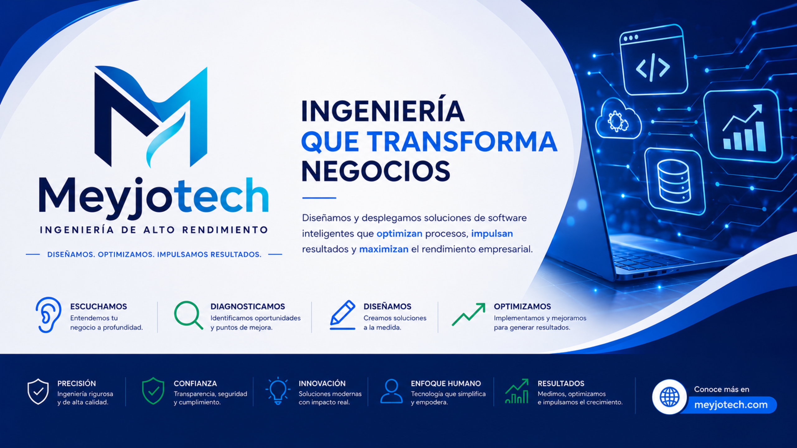

<p align="center">
  
</p>

<p align="center">
  <a href="https://readme-typing-svg.demolab.com">
    
  </a>
</p>

<p align="center">
  <a href="https://meyjotech.com"></a>
  <a href="mailto:contacto@meyjotech.com"></a>
  <a href="https://wa.me/573178727294"></a>
  <a href="https://github.com/Meyjo"></a>
  
</p>

---

## 🏛️ Executive Overview / Perfil Ejecutivo

<details open>
<summary><b>🇪🇸 Versión en Español</b></summary>
<br />

Soy **Andrés Darío Tello Burbano**, Arquitecto de Software, Ingeniero de Sistemas y Fundador de **[Meyjotech](https://meyjotech.com)** (_High-Performance Engineering for Critical Business Operations_).

Especializado en el diseño y despliegue de **ecosistemas de software de misión crítica**, **modernización de infraestructuras legacy** (COBOL / ERPs tradicionales) e **inteligencia artificial conversacional 24/7** integrada a procesos de negocio. Mi trabajo se rige por el principio de **alta ingeniería sin fricción**: código estructurado bajo _Clean Architecture_, interfaces de ultra-alta densidad (_PySide6/Qt_) y arquitecturas de resiliencia total (_Fail-Fast_, cero tolerancia a reflexiones dinámicas no verificadas y latencia ultrabaja en el edge).

> _"Diseñamos y desplegamos ecosistemas de software a medida, modernización de sistemas legacy e inteligencia artificial conversacional que eliminan cuellos de botella operativos, blindan el flujo de caja y maximizan el rendimiento de empresas B2B."_

</details>

<details>
<summary><b>🇺🇸 English Version</b></summary>
<br />

I am **Andrés Darío Tello Burbano**, Software Architect, Systems Engineer, and Founder of **[Meyjotech](https://meyjotech.com)** (_High-Performance Engineering for Critical Business Operations_).

Specialized in architecting and deploying **mission-critical software ecosystems**, **legacy modernization** (COBOL / traditional enterprise ERPs), and **24/7 conversational artificial intelligence** integrated directly into real-time business operations. My engineering philosophy focuses on **robust, zero-friction engineering**: Clean Architecture, high-density desktop interfaces (_PySide6/Qt_), and fail-fast distributed systems with sub-30ms edge latency.

> _"We engineer and deploy custom enterprise software, legacy system modernization, and conversational AI that eliminate operational bottlenecks, safeguard cash flow, and maximize B2B business performance."_

</details>

---

## 🧭 Ecosistema de Productos & Casos de Estudio (_By Meyjotech_)

Todos los sistemas desarrollados bajo la firma incorporan el sello de calidad **Engineered by Meyjotech**, resolviendo dolores operativos complejos con arquitecturas sólidas y retornos de inversión (ROI) comprobados.

```
                                  MEYJOTECH
                        (Firma de Ingeniería & Consultoría)
                                       │
         ┌───────────────────┬───────────────────┬───────────────────┐
         ▼                   ▼                   ▼                   ▼
     INVENIO             Orbit-IMP            INSU AI           SiigoBridge
• Supply Chain Analytics • Quoting ERP Stone  • WhatsApp AI Edge  • COBOL ISAM Bridge
• Modernización COBOL    • Multi-DB SQLite    • Clean Arch 5 Lyr  • PostgreSQL COPY
• Motor Predictivo VDP   • Mermas & ReportLab • Real-Time Kanban  • Cripto Ed25519
```

### 1. 📊 INVENIO (by Meyjotech) — _Intelligent Inventory & Sales Management Ecosystem_

Plataforma analítica desktop de alta densidad orientada a eliminar la ceguera operativa y prevenir quiebres de stock en distribuidoras multisede conectadas a sistemas contables legacy.

- **Reto de Arquitectura:** Integración no invasiva a bases de datos legacy **SIIGO Pyme (COBOL)** sin saturar el motor transaccional.
- **Solución Técnica:** Pipeline ETL autónomo desacoplado con servidor vinculado `[SIIGO_LINK]` (`OPENQUERY`) hacia Microsoft SQL Server. Motor analítico matemático híbrido propietario **VDP (Venta Diaria Proyectada)**:

  $$
  \text{VDP} = (\text{EMA}_{\text{reciente}} \times 0.80) + (\text{Estacionalidad}_{\text{YoY}} \times 0.20)
  $$

  complementado con escudo de rotación por varianza (CV) y cortes duros por inactividad.

- **Frontend / UI:** Interfaz de usuario en **PySide6** de ultra-alta densidad (`CustomTreeView`) con agrupación jerárquica multinivel drag-and-drop, filtros interactivos y renderizado asíncrono desacoplado en `QThreads`.
- **Impacto Comprobado:** Reducción del tiempo de consolidación de inventario multisede de **4 horas diarias a tiempo real (<1 segundo)**; proyección de liberación de capital inmovilizado del **18% al 32%**.

### 2. 🪨 Orbit-IMP (by Meyjotech) — _Stone Surface Quoting, Cash Flow & Production ERP_

ERP especializado para la industria de manufactura y comercialización de superficies arquitectónicas de piedra (mármol, granito, cuarzo, sinterizados) y gestión financiera de cajas multisede.

- **Reto de Arquitectura:** Eliminación de errores en el costeo paramétrico de piezas complejas (área $m^2$, longitud lineal, huecos de estufa/poceta, zócalos y porcentajes dinámicos de merma por plancha).
- **Solución Técnica:** Motor matemático de despiece de precisión; arquitectura de persistencia **SQLite Multi-DB** aislada por dominio y sede (`clients.db`, `budgets.db`, `flow.db`) con claves atómicas prefijadas (`CLF_0001`), borrado lógico estricto de 3 estados y respaldos en la nube en segundo plano vía **Google Drive API v3 (OAuth 2.0)**.
- **Motor Documental:** Generación programática vectorial de cotizaciones comerciales ejecutivas y recibos de caja mediante **ReportLab Canvas Engine**.
- **Impacto Comprobado:** **100% de precisión** en cálculo de mermas; reducción del tiempo de elaboración de cotizaciones formales de **45 minutos a menos de 3 minutos**.

### 3. 🤖 INSU AI (by Meyjotech) — _Omnichannel Conversational AI & Smart Logistics Ecosystem_

Ecosistema full-stack de comercio conversacional en WhatsApp Business, atención automatizada 24/7 y orquestación logística de despachos para empresas mayoristas.

- **Reto de Arquitectura:** Garantizar disponibilidad continua 24/7, protección absoluta contra inyecciones de prompt (_Prompt Injection_) y sincronización en milisegundos con inventarios reales de bodega.
- **Solución Técnica:**
  - **Edge Buffer Serverless (<30ms):** Worker en Cloudflare Edge con KV Store que absorbe picos de webhooks de la **Meta WhatsApp Cloud API v26** sin pérdida de mensajes ante caídas del servidor local.
  - **Backend & Clean Architecture:** API de alto rendimiento en **FastAPI (Python 3.14)** construida en 5 capas concéntricas con principio **Fail-Fast** estricto (0 uso de `hasattr`).
  - **Cerebro Conversacional:** **Google Gemini 3.1** con Function Calling cross-database en caliente hacia INVENIO (`[SNAPSHOT_INVENTARIO]`) y máquina de estados basada en psicología de negociación y Empatía Táctica.
  - **Dashboard Operativo:** Aplicación de escritorio en **PySide6** conectada vía **WebSockets bidireccionales**, renderizador multimedia polimórfico y **Tablero Kanban Logístico Bifurcado** para control de tiempos de empaque y rutas de entrega.
- **Impacto Comprobado:** Recuperación estimada del **35% de ventas perdidas** fuera de horario comercial y automatización completa del ciclo de pedido en clientes recurrentes en menos de 90 segundos.

### 4. 🌉 SiigoBridge (by Meyjotech) — _Enterprise Binary Data Bridge (COBOL to PostgreSQL)_

Puente de datos de ultra-alto rendimiento para la ingesta y extracción desatendida de archivos binarios propietarios **Micro Focus COBOL ISAM (IDXFORMAT 3/4)** hacia **PostgreSQL**.

- **Ingeniería de Bajo Nivel:** Parser binario de lectura compartida `rb` pura (sin bloqueos de concurrencia a usuarios de SIIGO ERP) con decodificación de campos empaquetados `COMP-3` (Packed Decimal BCD) y mapeo de esquemas maestros contables (Z03, Z04, Z06, Z08, Z09, Z26).
- **Rendimiento Extremo:** Ingesta por streaming nativo con `psycopg3` utilizando el protocolo `COPY ... FROM STDIN` de PostgreSQL a tasas de decenas de miles de registros por segundo.
- **Seguridad Corporativa:** Licenciamiento criptográfico asimétrico **Ed25519** atado al hardware del servidor (_Machine Fingerprinting_ determinista de Placa Base, CPU y Almacenamiento). Ejecutable compilado nativamente con **Nuitka** y orquestación como servicio nativo de Windows mediante **NSSM**.

---

## 🛠️ Stack Tecnológico & Arquitectura

<p align="center">
  
</p>

```
┌─────────────────────────┬────────────────────────────────────────────────────────────────────────────┐
│ Capa de Arquitectura    │ Tecnologías, Motores & Protocolos Principales                              │
├─────────────────────────┼────────────────────────────────────────────────────────────────────────────┤
│ Backend & APIs          │ FastAPI · Python 3.14 · RESTful APIs · WebSockets · Pydantic v2 · PyODBC   │
│ Inteligencia Artificial │ Google Gemini 3.1 Flash-Lite · Function Calling · WhatsApp Cloud API v26   │
│ Desktop UI & Front      │ PySide6 (Qt for Python) · Custom QWidgets · QSS Themes · ReportLab PDF     │
│ Bases de Datos          │ Microsoft SQL Server · PostgreSQL (COPY Stream) · SQLite Multi-DB · ISAM   │
│ Infraestructura & Edge  │ Cloudflare Workers / KV · Zero Trust Tunnels · Windows Server · NSSM       │
│ Seguridad & Cripto      │ Criptografía Asimétrica Ed25519 · Machine Fingerprinting · PBKDF2 Hashing  │
└─────────────────────────┴────────────────────────────────────────────────────────────────────────────┘
```

---

## 🔄 Metodología de Servicio: Los 4 Pasos Meyjotech

Cada proyecto de consultoría o ingeniería desarrollado bajo la marca se ejecuta con un ciclo riguroso y transparente:

1. 👂 **1. ESCUCHAMOS:** Inmersión técnica en el modelo operativo de la empresa, levantamiento de restricciones de negocio y mapeo de cuellos de botella.
2. 🔍 **2. DIAGNOSTICAMOS:** Auditoría de arquitectura de software, viabilidad técnica, análisis de datos existentes y modelado del Retorno de Inversión (ROI).
3. ✏️ **3. DISEÑAMOS:** Construcción bajo _Clean Architecture_, interfaces ejecutivas intuitivas y acuerdos de alcance estricto (_Scope-Lock Delivery_).
4. 📈 **4. OPTIMIZAMOS:** Despliegue en producción, telemetría continua, acompañamiento al equipo y pólizas de soporte evolutivo de alta disponibilidad (SLA).

---

## 📊 Métricas de Ingeniería en GitHub

<p align="center">
  
  
</p>

---

## 🤝 Conectemos / Hablemos de Negocios (B2B)

¿Buscas modernizar la infraestructura tecnológica de tu empresa, integrar inteligencia artificial conectada a tus inventarios reales o auditar la arquitectura de tus sistemas?

- 🌐 **Sitio Web Oficial:** [meyjotech.com](https://meyjotech.com)
- ✉️ **Correo Corporativo:** [contacto@meyjotech.com](mailto:contacto@meyjotech.com)
- 📍 **Ubicación:** Colombia (Servicios Remotos Nacionales e Internacionales)

<p align="center">
  <sub><b>Meyjotech</b> — <i>High-Performance Engineering for Critical Business Operations</i></sub>
</p>
